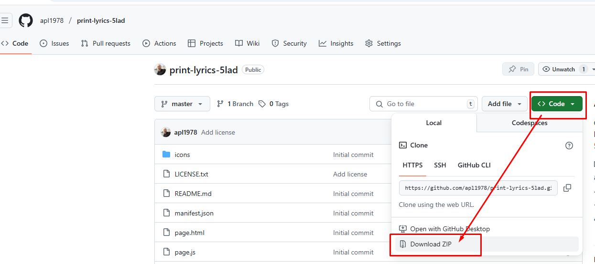
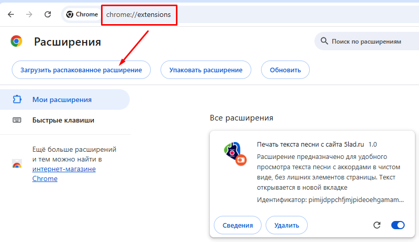

# Печать текста песни с сайта 5lad.ru

Расширение для Google Chrome предназначено для удобного просмотра текста песни с аккордами в чистом виде,
без лишних элементов страницы. Текст открывается в новой вкладке.
Чтобы распечатать содержимое вкладки, нажмите Ctrl+P. 

### Принцип работы:

- Создается новая вкладка браузера
- В новой вкладке отображается только текст песни и аккорды
- Исходная страница остается открытой
- Может легко переключаться между вкладками

### Технические детали:

- Извлекает текст песни из исходной страницы
- Удаляет все лишние элементы интерфейса
- Открывает результат в новой вкладке

## Установка:

1. Скачайте архив с расширением:

2. Распакуйте архив в удобное место
3. В браузере откройте меню -> Расширения -> Управление расширениями или перейдите по адресу chrome://extensions/
4. Нажмите кнопку "Загрузить распакованное расширение" и в открывшемся диалоге выберите папку, в которой находится расширение с файлом manifest.json.
5. Расширение должно отобразиться в списке
